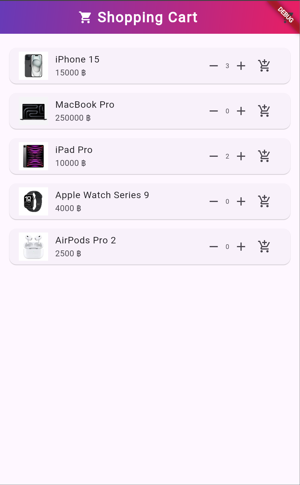

# Shopping_Cart_Flutter

**Shopping_Cart_Flutter** is a Flutter application that simulates a simple shopping cart system. This project demonstrates concepts such as dynamic state management, navigation, and user interaction within a modern mobile application. It includes a clean and user-friendly interface for managing items and cart functionality.

---

## Features

- **Product Listing**: Displays a scrollable list of products with images, names, and prices.
- **Add to Cart**: Easily add items to the cart with a single tap.
- **Cart Management**: Increase or decrease item quantities in the cart or remove items entirely.
- **Total Calculation**: Dynamically updates the total price based on the items in the cart.
- **Clear Cart**: Provides a button to clear all items from the cart.
- **Navigation**: Smooth navigation between the product list and cart pages.
- **Responsive Design**: Supports various screen sizes and orientations.

---

## Screenshot

### Home Screen (Product List)


### Cart Screen
<div style="display: flex;">
  
  
</div>


---

## Getting Started

This project is a great starting point for learning Flutter application development. Below are the steps to set up and run the application:

### Prerequisites

Ensure you have the following tools installed:

- Flutter SDK (version 3.0 or later)
- Dart SDK
- An IDE such as Android Studio, IntelliJ IDEA, or Visual Studio Code

### Installation

1. Clone the repository:
   ```bash
   git clone https://github.com/your_username/Shopping_Cart_Flutter.git
   ```

2. Navigate to the project directory:
   ```bash
   cd Shopping_Cart_Flutter
   ```

3. Fetch the dependencies:
   ```bash
   flutter pub get
   ```

4. Run the application on an emulator or physical device:
   ```bash
   flutter run
   ```

---

## Folder Structure

```
Shopping_Cart_Flutter/
│
├── lib/
|   ├──shopping/
│   |    ├── main.dart           # Application entry point
│   |    ├── cartPage.dart       # Cart page implementation
│   |    ├── item.dart           # Item model
│
├── assets/
│   ├── images/             # Product images
│
└── README.md               # Project documentation
```

---

## Resources

To learn more about Flutter development, explore the following resources:

- [Flutter Documentation](https://docs.flutter.dev/)
- [Write your first Flutter app](https://docs.flutter.dev/get-started/codelab)
- [Flutter Cookbook](https://docs.flutter.dev/cookbook)

---

## Contributing

Contributions to this project are welcome! Feel free to submit issues or pull requests to enhance the functionality or improve the code.

---

### About the Project

This project showcases essential Flutter concepts and provides a solid foundation for developing more advanced mobile applications. It is ideal for learning and experimentation in mobile app development.

Happy coding with Flutter! 🚀
